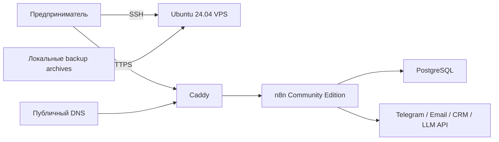
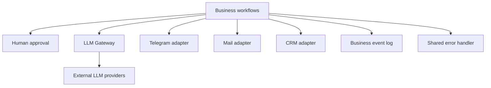

# Архитектура MVP

## Назначение

Документ фиксирует целевую архитектуру и границы. Конкретные версии контейнеров, точные n8n node capabilities, provider API и license status выбираются только после research-задач и фиксируются ADR с датой проверки.

## Контекст системы

## Базовый runtime

- Один VPS на Ubuntu 24.04 LTS x86_64.
- Docker Compose управляет тремя сервисами: Caddy, n8n и PostgreSQL.
- Caddy — единственная публичная HTTP(S)-точка и автоматически управляет TLS.
- n8n доступен Caddy по внутренней Docker network.
- PostgreSQL доступен только n8n по внутренней сети и не имеет host port binding.
- Данные n8n, PostgreSQL и Caddy хранятся в отдельных persistent volumes.
- Сервисы имеют health checks и restart policy для восстановления после reboot.
- Все images закреплены на явно проверенных версиях; `latest` запрещён.

## Почему Caddy

Caddy выбран для базового профиля из-за небольшой конфигурационной поверхности и автоматического HTTPS. Выбор не отменяет обязательную проверку актуальной официальной документации, требований ACME, forwarded headers и pinned release в research-задаче.

## Установка

`scripts/install.sh` — единая точка входа. Он должен:

1. проверить ОС, архитектуру, ресурсы, sudo, порты, домен, DNS и исходящую сеть;
2. установить или проверить системные зависимости и Docker из официально поддерживаемого источника;
3. собрать интерактивную конфигурацию или прочитать config/env;
4. сгенерировать secrets без вывода в logs и записать `.env` с `0600`;
5. подготовить Compose stack без перезаписи существующих данных;
6. запустить сервисы и выполнить те же существенные проверки, что `doctor.sh`;
7. показать URL, пути и команды безопасной эксплуатации.

Повторный запуск должен быть разумно идемпотентным. `--dry-run` не меняет систему. Изменение firewall выполняется только после отдельного подтверждения и не должно обрывать текущий SSH-доступ.

## Операционный контур

- `doctor.sh`: host, DNS, ports, containers, PostgreSQL, internal n8n, external HTTPS/certificate/webhook base URL.
- `backup.sh`: согласованный dump/config/volume data, версионированный archive и checksum.
- `restore.sh`: проверка checksum, совместимости и явное подтверждение до изменения данных.
- `update.sh` / `rollback.sh`: переход только на явно заданную версию с preflight, backup и health validation.
- `uninstall.sh`: останавливает и удаляет containers, но не удаляет данные автоматически.
- `import-workflows.sh` / `export-workflows.sh`: управляют workflow без credentials в JSON.

## LLM abstraction

Бизнес-workflow не вызывают provider-specific API напрямую. Они обращаются к reusable `LLM Gateway` sub-workflow с нормализованным входом и структурированным выходом.

Приоритет:

1. generic OpenAI-compatible endpoint с Base URL, API key, model ID, optional `/models` и ручным fallback;
2. Yandex AI Studio после проверки официальной OpenAI-совместимости и identifiers;
3. GigaChat через безопасный OAuth lifecycle без ручного обновления временного token;
4. другие endpoints только по подтверждённой capability matrix.

Credentials создаются в n8n и никогда не встраиваются в workflow JSON. LiteLLM рассматривается только как отдельный optional profile, если нативный n8n + gateway workflow не закрывает подтверждённые требования.

## Workflow layers

Core sub-workflows: LLM Gateway, Send Telegram Message, Request Human Approval, Normalize Incoming Message, CRM Create or Update Lead, CRM Create Task, Log Business Event и Handle Workflow Error.

Business workflows: Telegram assistant, email assistant, lead handler и daily executive digest. Любое внешнее сообщение или изменение CRM требует human approval по умолчанию; Telegram assistant работает в `draft-only` по умолчанию.

## Trust boundaries и secrets

- Internet → Caddy: разрешены только необходимые публичные порты 80/443.
- Caddy → n8n и n8n → PostgreSQL: приватные Compose networks.
- n8n → внешние API: исходящие TLS-запросы с credentials из n8n credential store.
- SSH → host: firewall changes не применяются без подтверждения и проверки SSH rule.
- Git → runtime: `.env`, credentials, backup archives и реальные fixtures исключаются.
- Docker socket не монтируется в n8n; privileged mode и лишние capabilities запрещены.
- Постоянный `N8N_ENCRYPTION_KEY` и права `.env` `0600` обязательны.
- Execution data может содержать ПДн; retention/pruning включены и объяснены пользователю.

## Quality strategy

Пирамида проверок:

1. static: shellcheck, formatting, syntax, JSON validation и secret scan;
2. configuration: `docker compose config`, pinned images и security assertions;
3. integration: workflow import, n8n↔PostgreSQL, internal health, scripts idempotency;
4. destructive lifecycle: backup/delete/restore и update/rollback;
5. external smoke: DNS, HTTPS certificate, webhook, LLM и Telegram с user-provided credentials;
6. reboot persistence на реальной или disposable Ubuntu среде;
7. novice usability trial на 15–30 минут.

Непроверенные шаги маркируются как требующие VPS/credentials. Симуляция не считается успехом.

## Архитектурные ограничения

- Версии и provider claims не фиксируются в этом документе без dated evidence.
- Базовый профиль остаётся односерверным и понятным новичку.
- Расширение платформы, queue mode или proxy layer требует отдельного ADR и измерения влияния на RAM, установку и сопровождение.
