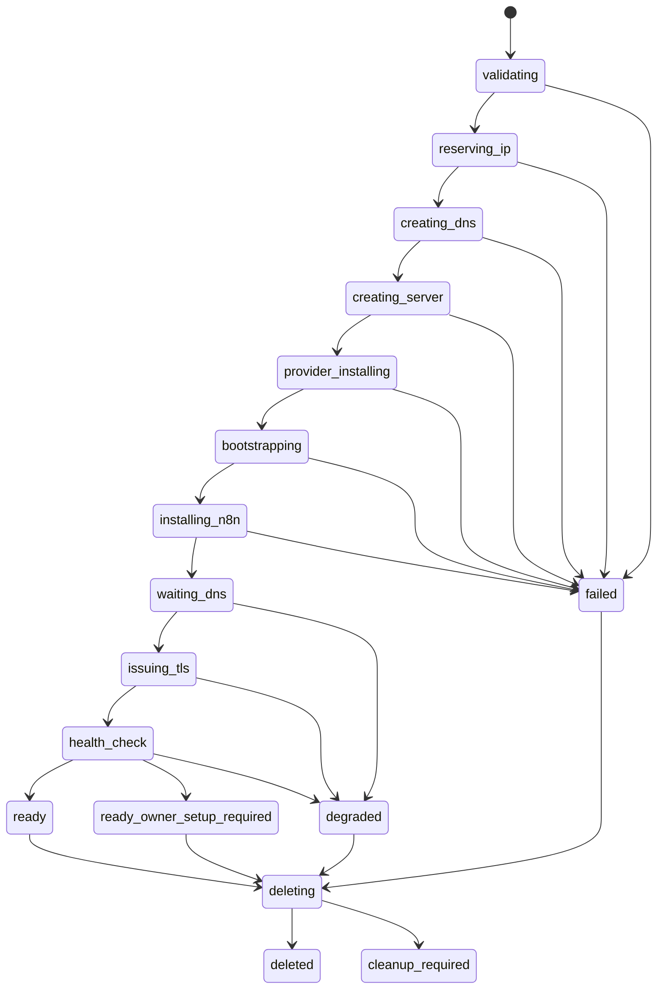
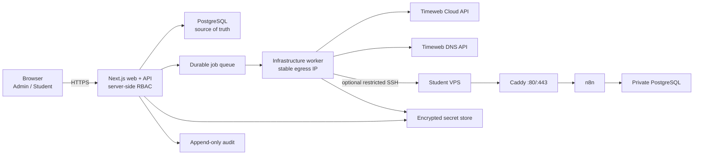

# Требования к платформе курса и управлению учебной инфраструктурой

**Статус:** требования первого этапа  
**Задача:** `T-0048`  
**Дата проверки внешних источников:** 2026-07-29  
**Язык интерфейса первого этапа:** русский

## 1. Решение

Платформу курса следует создавать как отдельное web-приложение — control plane, которое управляет пользователями, учебными средами и длительными инфраструктурными операциями. Репозиторий `n8n Entrepreneur Starter Kit` остаётся версионируемым установочным артефактом и не превращается в web-приложение.

Первый пользовательский результат:

1. администратор входит в платформу;
2. открывает первый раздел боковой панели «Инфраструктура»;
3. создаёт учебную среду на Timeweb Cloud;
4. платформа создаёт VPS, DNS-запись, устанавливает проверенную версию starter kit, дожидается HTTPS и показывает итоговый URL;
5. администратор видит каждый шаг, ошибку и стоимость ресурсов;
6. администратор может безопасно удалить среду и связанные с ней платные ресурсы.

Интерфейс ученика на первом этапе ограничен авторизацией, личной стартовой страницей и просмотром назначенной ему готовой среды. LMS-функции добавляются последующими этапами.

## 2. Основания и границы документа

Требования согласованы с текущими [product brief](product-brief.md), [архитектурой starter kit](architecture.md), [инструкцией установки](installation.md), [Timeweb Cloud guide](timeweb-cloud.md) и [чистой установкой Timeweb](timeweb-clean-install.md).

Из соседних проектов изучены:

- `projects-control`: структура desktop/mobile shell, сгруппированная боковая навигация, журнал операций, ограничение стоимости, безопасное подтверждение удаления, bounded logs и redaction;
- `crm-flow`: базовый вариант Next.js, PostgreSQL и session-based авторизации;
- `alfa-deepeval-neuroffice`: durable jobs, leases, retries, отмена и восстановление после прерывания worker.

Из соседних проектов заимствуются паттерны, а не код и не их ограничения. В частности, локальная single-user модель `projects-control` не подходит платформе с ролями и облачными credentials.

Проверенные внешние факты:

- Timeweb позволяет создавать VPS через API и передавать `cloud-init` при создании; `cloud-init` выполняется без интерактивных запросов от `root` ([создание сервера](https://timeweb.cloud/docs/cloud-servers/manage-servers/create-server), [cloud-init](https://timeweb.cloud/docs/cloud-servers/manage-servers/cloud-init));
- Timeweb API token можно ограничить по сервисам и сроку действия; разрешение удалять сервисы без кода из Telegram задаётся отдельно ([API-токены](https://timeweb.cloud/docs/account-management/token));
- публичный IPv4 является отдельным тарифицируемым ресурсом, после удаления сервера может сохраниться и продолжить тарифицироваться ([публичные IP](https://timeweb.cloud/docs/public-ip));
- Timeweb поддерживает управление DNS-записями, включая `A`, `AAAA`, `CNAME` и `TXT`; стандартный TTL равен 600 секундам ([DNS-записи](https://timeweb.cloud/docs/domains/dns-records-management));
- для автоматического HTTPS Caddy домен должен разрешаться в сервер, порты 80/443 должны быть доступны, а данные Caddy — сохраняться между перезапусками ([Automatic HTTPS](https://caddyserver.com/docs/automatic-https));
- текущий starter kit поддерживает только Ubuntu 24.04 LTS x86_64, использует Caddy, PostgreSQL и закреплённый n8n; `.env` имеет права `0600`, а `N8N_ENCRYPTION_KEY` генерируется и хранится постоянно.

Цены, идентификаторы тарифов, образов и зон запрещено фиксировать в коде: они читаются из актуального API. Перед реализацией provider adapter исполнитель должен сверить DTO и доступные операции с текущей официальной спецификацией/SDK Timeweb. Этот документ не является свидетельством реального вызова Timeweb API, покупки VPS или выпуска сертификата.

Отдельный release gate — модель владения n8n. Официальное разъяснение n8n различает помощь клиенту с его собственным instance и hosting/management клиентских workflow и credentials ([n8n license use cases](https://support.n8n.io/article/can-i-use-your-license-for-my-use-case), [Sustainable Use License](https://docs.n8n.io/sustainable-use-license/)). Если серверы остаются в аккаунте школы, а ученики используют размещённый и управляемый школой n8n, до production запуска требуется письменное подтверждение допустимой лицензии от n8n. Этот документ не является юридическим заключением.

## 3. Цели первого этапа

### 3.1. Продуктовые цели

- Убрать ручной переход администратора между Timeweb, SSH, DNS и инструкциями установки.
- Сделать создание одной готовой учебной среды одной управляемой операцией.
- Сохранить для администратора прозрачность: какие ресурсы созданы, сколько они ориентировочно стоят и на каком шаге возникла ошибка.
- Не давать ученику доступ к облачному аккаунту, root SSH и инфраструктуре других учеников.
- Создать основу для будущих модулей курса без преждевременной реализации LMS.

### 3.2. Метрики результата

- Не менее 95% запусков в тестовом окружении либо завершаются состоянием `ready`, либо показывают конкретный неисправный шаг и безопасное действие восстановления.
- Между нажатием «Создать среду» и стартом фоновой операции проходит не более 2 секунд при нормальной работе control plane.
- Администратор видит обновление длительной операции не позднее чем через 5 секунд после изменения её состояния.
- Ни один API token, SSH private key, пароль или `N8N_ENCRYPTION_KEY` не попадает в браузер, application log, audit payload или Git.
- Удаление среды не оставляет принадлежащий ей тарифицируемый IPv4 незамеченным: ресурс удалён либо интерфейс показывает критический `cleanup_required`.

## 4. Scope

### 4.1. Первый этап, срез 1A — control plane и VPS

- responsive web-приложение на Next.js App Router и shadcn/ui;
- авторизация и серверный RBAC для ролей `admin` и `student`;
- desktop/mobile application shell;
- подключение Timeweb Cloud account;
- чтение актуальных регионов, зон, образов, конфигураций и доступного баланса, если это предоставляет API;
- список, создание, просмотр состояния и безопасное удаление VPS;
- durable operations, audit log, cost guardrails и обработка частичного сбоя.

### 4.2. Первый этап, срез 1B — готовая среда n8n

- выделение доменного имени под управляемой базовой зоной;
- создание DNS `A`-записи;
- bootstrap сервера через `cloud-init`;
- установка exact version/checksum starter kit с `N8N_HOST`;
- ожидание DNS, HTTPS и health checks;
- отображение URL и статуса n8n;
- установка n8n на совместимый уже созданный платформой сервер;
- удаление сервера, DNS, SSH-ключа и IP по зафиксированной ownership-модели.

Срезы входят в один продуктовый этап, но реализуются и проверяются последовательно. Нельзя объединять первую проверку Timeweb API с непрозрачным «создать всё» без промежуточных состояний.

### 4.3. Не входит в первый этап

- уроки, видео, домашние задания, прогресс, платежи и сертификаты об окончании курса;
- native iOS/Android приложения;
- массовое создание серверов;
- другие облачные провайдеры;
- управление n8n workflow и credentials учеников;
- автоматический backup/restore и обновление n8n;
- managed multi-tenant n8n, queue mode, HA и Kubernetes;
- передача VPS между аккаунтами Timeweb и автоматический перенос billing ownership;
- автоматическое создание owner account n8n без подтверждённого официального и безопасного интерфейса;
- автоматическая покупка домена;
- самостоятельная смена учеником тарифа, домена или сетевых правил.

## 5. Роли и доступ

### 5.1. Роли

| Возможность | Student | Admin |
|---|---:|---:|
| Войти/выйти, изменить собственный пароль | Да | Да |
| Открыть свою стартовую страницу | Да | Да |
| Видеть назначенную ему среду и публичный URL | Да | Да |
| Видеть IP, provider ID, операции и стоимость других сред | Нет | Да |
| Создавать/устанавливать/удалять сервер | Нет | Да |
| Менять Timeweb credentials и инфраструктурные профили | Нет | Да |
| Читать аудит инфраструктуры | Нет | Да |
| Назначать среду ученику | Нет | Да |

Отсутствие пункта в UI не является контролем доступа. Каждая server action, server component query и API route выполняет проверку сессии, роли и принадлежности ресурса. Запрос ученика к `/admin/**` возвращает `403`, не раскрывая существование чужих ресурсов.

### 5.2. Авторизация

- Первый admin создаётся одноразовой bootstrap-командой или одноразовым setup flow, который после использования необратимо закрывается.
- Пароли хешируются Argon2id либо механизмом выбранного проверенного auth provider с эквивалентной защитой.
- Сессия хранится в `HttpOnly`, `Secure`, `SameSite=Lax` cookie; state-changing запросы защищены от CSRF.
- Login и recovery endpoints имеют rate limit и audit событий, но audit не хранит пароль или токен восстановления.
- Изменение provider token и удаление инфраструктуры требуют свежей повторной аутентификации; целевой максимум возраста подтверждения — 10 минут.
- Перед production release для admin включается MFA либо фиксируется отдельное решение с владельцем о принятом риске.
- Блокировка пользователя отзывает его активные сессии.

## 6. Информационная архитектура

### 6.1. Admin shell

Левая панель повторяет понятный паттерн `projects-control`, но отражает платформу курса:

1. **Инфраструктура** — первый и открытый по умолчанию раздел:
   - Серверы;
   - Операции;
   - Домены и DNS;
   - Подключение Timeweb.
2. **Ученики** — минимальный список, приглашение/создание и назначение среды.
3. **Аудит**.
4. **Настройки**.

Desktop: сворачиваемая панель шириной около 256 px, хлебные крошки, global command/search по `Cmd/Ctrl+K`, основной scroll-контейнер. Mobile: панель открывается как shadcn `Sheet`, закрывается после перехода; ключевое действие доступно без горизонтального скролла.

### 6.2. Экран «Серверы»

Обязательные состояния: loading skeleton, empty state, частичная ошибка провайдера, список, отсутствие прав.

В списке отображаются:

- имя среды;
- ученик/владелец;
- статус платформы и сырой provider status во всплывающей детали;
- регион/зона и конфигурация;
- публичный IP;
- домен;
- n8n version и health;
- оценка текущих расходов из provider data;
- последняя операция и время обновления;
- меню допустимых действий.

На desktop используется shadcn `Table`, на узком экране — адаптивные `Card` без потери критических полей. Поддерживаются поиск, фильтр по статусу/ученику и сортировка по имени, расходам и последнему изменению.

### 6.3. Карточка среды

Вкладки или секции:

- «Обзор»: URL, назначенный ученик, конфигурация и provider identifiers;
- «Операции»: timeline шагов, повторы и понятная причина ошибки;
- «ПО»: установленный профиль, version, health и действие установки;
- «Домен и TLS»: DNS record, состояние разрешения, issuer и срок сертификата;
- «Опасная зона»: удаление и cleanup.

Секреты, cloud-init body и private key никогда не отображаются. Технические логи ограничены по объёму, очищены от секретов и доступны только admin.

### 6.4. Мастер создания

1. Имя среды и необязательное назначение ученику.
2. Регион/зона, актуальный preset и образ Ubuntu 24.04 x86_64.
3. Публичный/переносимый IP.
4. Уникальный subdomain под управляемой базовой зоной.
5. Профиль установки n8n и его exact version.
6. Preview: создаваемые ресурсы, оценка цены, сетевые правила и план cleanup.
7. Подтверждение и переход к экрану операции.

Мастер не принимает произвольный shell script. Профили установки версионируются и выбираются из allowlist.

### 6.5. Визуальный язык

- Использовать официальный shadcn/ui как source-copied component foundation и Radix primitives.
- Базовый стиль — `new-york`, шрифт Geist, нейтральная палитра `zinc`/`slate`, один спокойный accent.
- Semantic colors применяются только по смыслу: success, warning, destructive, info.
- Использовать `Card`, `Badge`, `Table`, `DropdownMenu`, `Sheet`, `Tabs`, `Skeleton`, `Alert`, `AlertDialog`, `Tooltip`, `Command` и form components.
- Не собирать собственные кнопки, модальные окна, tabs или dropdown при наличии shadcn-компонента.
- Темизация строится на CSS variables/tokens; компоненты не содержат случайных hex-цветов.
- Все действия доступны с клавиатуры; focus видим; статус фоновой операции объявляется через `aria-live`.
- Минимальная поддерживаемая ширина — 360 px, touch target — не менее 44×44 px.

## 7. Сценарии и функциональные требования

### 7.1. Подключение Timeweb

`PROV-01` Admin вводит API token в защищённую серверную форму. После сохранения raw token нельзя получить через API или UI.

`PROV-02` Система проверяет token read-only запросом, получает account/capabilities и показывает маску, дату проверки и доступные разрешения.

`PROV-03` Рекомендуется два credentials:

- `provisioner`: чтение, создание и изменение нужных сервисов без права удаления;
- `destroyer`: минимальный token с правом удаления без Telegram-кода, доступный только delete worker.

Если владелец не разрешает автоматическое удаление без Telegram-кода, платформа создаёт cleanup operation в состоянии `manual_confirmation_required`, а не обходит защиту.

`PROV-04` Provider adapter находится только на сервере и имеет versioned internal interface. Browser никогда не обращается к Timeweb напрямую.

`PROV-05` Идентификаторы preset, OS, project, region/zone и стоимость загружаются из API. При недоступности provider UI показывает cached data как устаревшие и запрещает платные mutation, если безопасный preview невозможен.

### 7.2. Создание VPS

`INF-01` `POST` создания отвечает `202 Accepted` и `operationId`; HTTP request не ждёт установки VPS.

`INF-02` До mutation выполняется preflight:

- admin и свежая re-auth;
- provider credentials доступны;
- имя и subdomain уникальны;
- лимит одновременно активных сред не превышен;
- хватает настроенного бюджета/доступного баланса;
- выбранные IP и сервер находятся в совместимой зоне;
- образ соответствует Ubuntu 24.04 x86_64;
- отсутствует другая активная mutation этой среды.

`INF-03` Платформа резервирует переносимый публичный IP, создаёт DNS `A` на него, затем создаёт VPS с этим IP и `cloud-init`. Это позволяет знать DNS target до запуска Caddy.

`INF-04` Если резервирование IP до VPS невозможно для выбранной конфигурации, adapter использует подтверждённый альтернативный порядок и фиксирует его отдельным provider capability flag.

`INF-05` На каждый созданный объект записываются provider ID, kind, ownership и operation ID. Комментарий/label ресурса, если поддерживается, содержит неприватный стабильный environment ID.

`INF-06` После timeout система не повторяет `create` вслепую. Она сначала reconciles provider resources по сохранённому ID/label и только после этого повторяет безопасный шаг.

### 7.3. Bootstrap и установка n8n

`N8N-01` Default путь первого создания использует versioned `cloud-init`, а не интерактивный SSH.

`N8N-02` `cloud-init`:

- не содержит provider tokens, application secrets, пароли пользователей или заранее сгенерированный `N8N_ENCRYPTION_KEY`;
- скачивает установочный артефакт exact release URL;
- проверяет закреплённый SHA-256;
- передаёт публичный `N8N_HOST`;
- запускает installer в non-interactive режиме;
- сохраняет локальные secrets только на VPS по контракту starter kit;
- записывает bounded результат bootstrap без вывода секретов.

Использование `releases/latest` в production profile запрещено.

`N8N-03` Exact profile ссылается на совместимый commit/release starter kit и pins из [architecture.md](architecture.md). Изменение версии выполняется новой версией profile и отдельной проверкой.

`N8N-04` Результат подтверждается наблюдаемыми проверками, а не только завершением `cloud-init`:

- provider server status рабочий;
- DNS `A` разрешается в ожидаемый IP;
- TCP 80/443 доступны;
- HTTPS certificate валиден для hostname;
- `/healthz` отвечает ожидаемо;
- страница editor открывается без redirect loop.

`N8N-05` Для установки на уже существующий управляемый сервер допускается отдельный remote execution worker. Он использует уникальную ED25519 key pair на сервер, encrypted private key и SSH allowlist только с постоянного egress IP worker. Один общий root key для всех VPS запрещён.

`N8N-06` Платформа не заявляет, что owner account n8n создан автоматически, пока для выбранной версии не подтверждён официальный безопасный API/CLI. В готовой среде допускается финальное состояние `ready_owner_setup_required` с инструкцией открыть URL и создать owner.

`N8N-07` До выдачи production-среды ученику сохраняется evidence выбранной лицензионной модели: собственный instance ученика, коммерческое соглашение n8n либо иное письменное разрешение. Наличие технически работающего VPS не снимает этот gate.

### 7.4. DNS и TLS

`DNS-01` Первый этап поддерживает subdomain только в заранее подключённой Timeweb DNS zone, которой управляет администратор.

`DNS-02` Имя нормализуется, проверяется на уникальность и резервируется транзакционно до provider mutation.

`DNS-03` Платформа создаёт `A` record и сохраняет record ID. Удалять DNS разрешено только по сохранённому ID и подтверждённому ownership.

`DNS-04` UI различает `record_created`, `dns_propagating`, `dns_ready`, `tls_pending`, `tls_ready` и `tls_failed`.

`DNS-05` Caddy хранит persistent data. Публично открыты только 80/443; SSH 22 разрешён только с административного/worker CIDR. n8n 5678 и PostgreSQL наружу не публикуются.

### 7.5. Операции и состояния



`OPS-01` Operation и каждый step хранят durable status, attempt, started/finished timestamps, safe error code, correlation ID и provider request reference, если он доступен.

`OPS-02` Worker берёт step по lease. Потеря процесса освобождает lease по timeout; второй worker не может одновременно завершить тот же step.

`OPS-03` Retry применяется только к классифицированным transient errors с exponential backoff и jitter. Validation, permission и insufficient funds errors не повторяются автоматически.

`OPS-04` Admin может повторить допустимый failed step, отменить ещё не начатую операцию или запустить reconciliation. Уже отправленная provider mutation не считается отменённой до подтверждения provider state.

`OPS-05` Для среды допускается не более одной активной mutation. Read-only reconciliation и health check могут выполняться параллельно.

### 7.6. Удаление

`DEL-01` До удаления платформа показывает preview:

- VPS, IP, DNS record и SSH key, которые будут удалены;
- данные n8n, которые будут безвозвратно потеряны;
- ресурсы, которые будут сохранены;
- текущую оценку расходов;
- наличие/отсутствие подтверждённого backup.

`DEL-02` Admin вводит точное имя среды, отмечает подтверждение потери данных и проходит свежую re-auth. Используется shadcn `AlertDialog`; одной случайной кнопки недостаточно.

`DEL-03` Удаляются только ресурсы с сохранённым provider ID и ownership платформы. Поиск по похожему имени не является основанием удаления.

`DEL-04` Последовательность cleanup фиксируется state machine. После удаления VPS отдельно проверяется состояние публичного IP, потому что он может продолжить тарифицироваться.

`DEL-05` Если один ресурс не удалён, environment становится `cleanup_required`; UI показывает остаточный ресурс, расход и безопасное действие повтора. Audit/tombstone среды сохраняется.

`DEL-06` Опция «Сохранить IP» выключена по умолчанию и требует отдельного явного подтверждения стоимости.

## 8. Архитектура control plane



Рекомендуемый начальный shape — modular monolith:

- Next.js App Router для web UI, server components и versioned API;
- PostgreSQL как единый source of truth;
- DB-backed durable queue и отдельный worker process;
- server-only Timeweb adapter;
- encrypted secret storage с master key вне базы;
- отдельный deployment control plane, не на student VPS.

Web process и worker могут находиться в одном репозитории, но имеют разные runtime identities и permissions. Delete credential не доступен web process. При росте нагрузки provider adapter и worker можно отделить без изменения UI/API contract.

### 8.1. Внутренний API

Минимальный namespace:

```text
GET    /api/admin/infrastructure/environments
POST   /api/admin/infrastructure/environments/preview
POST   /api/admin/infrastructure/environments
GET    /api/admin/infrastructure/environments/:id
POST   /api/admin/infrastructure/environments/:id/install-n8n
DELETE /api/admin/infrastructure/environments/:id
GET    /api/admin/infrastructure/operations/:id
POST   /api/admin/infrastructure/operations/:id/retry
POST   /api/admin/infrastructure/provider-connections/test
PUT    /api/admin/infrastructure/provider-connections/timeweb
GET    /api/student/environment
```

Mutation принимает клиентский `idempotencyKey`, возвращает `operationId` и не возвращает provider secret. Ошибка имеет `code`, безопасное русское `message`, `correlationId` и необязательные `fieldErrors`. DTO версионируются; сырой Timeweb response не становится публичным контрактом.

### 8.2. Модель данных

| Сущность | Назначение |
|---|---|
| `users`, `auth_sessions`, `auth_factors` | identity, role, session revocation и MFA |
| `provider_connections` | masked metadata, capability snapshot и ссылка на encrypted secret |
| `infrastructure_profiles` | allowlisted OS, preset rules, installer version/checksum, network policy |
| `environments` | логическая учебная среда, ученик, публичный URL и итоговый status |
| `provider_resources` | server/IP/DNS/SSH-key IDs, kind, zone и ownership |
| `domain_allocations` | FQDN, zone, DNS record ID и reservation state |
| `software_installations` | profile/version, health и timestamps |
| `operations`, `operation_steps` | durable state, lease, attempts, error codes и compensation |
| `audit_events` | append-only actor/action/target/result с redaction |

Критические уникальные ограничения:

- один активный FQDN;
- один активный environment на provider server ID;
- один provider resource ID на account/kind;
- одна активная mutation на environment;
- один результат mutation на idempotency key и actor.

## 9. Безопасность и эксплуатационные ограничения

### 9.1. Секреты

- Provider tokens и SSH private keys шифруются envelope encryption; master key поступает из deployment secret manager и не хранится в PostgreSQL/Git.
- Secret можно заменить и отозвать, но нельзя прочитать обратно.
- Logs, audit, telemetry, errors и support export проходят recursive redaction и имеют ограничение размера.
- Production database backup считается secret material и шифруется.
- Raw `cloud-init` output не отдаётся в браузер; сохраняется только очищенный bounded excerpt либо ссылка на защищённый диагностический артефакт с TTL.

### 9.2. Снижение blast radius

- Разные credentials для provisioning и deletion.
- Отдельная runtime identity worker.
- SSH password login на создаваемом VPS выключен.
- У каждого сервера отдельный ключ; ключ удаляется после отказа от remote administration, если дальнейшие операции его не требуют.
- Firewall default-deny; 80/443 открыты публично, 22 — только trusted CIDR.
- Docker socket не монтируется в n8n; PostgreSQL и n8n port не публикуются.
- Platform admin не получает n8n encryption key через UI.

### 9.3. Аудит

Append-only audit фиксирует:

- входы, неуспешные входы, re-auth и изменения ролей;
- добавление, проверку, ротацию и удаление provider connection без raw secret;
- preview, запуск, повтор, отмену и результат инфраструктурной операции;
- actor, target, before/after безопасных полей, correlation ID и источник запроса;
- все destructive confirmations.

Изменение audit record через application API запрещено. Retention первого этапа — не менее 365 дней либо более строгий срок, утверждённый владельцем.

### 9.4. Стоимость и лимиты

- UI получает цену и баланс из Timeweb, когда API их предоставляет; иначе показывает «нет актуальных данных» и не выдумывает сумму.
- Конфигурация содержит warning/critical monthly budget, максимальное число активных сред и максимальную стоимость одного create preview.
- При превышении hard limit новые create блокируются; health, cleanup и delete остаются доступны.
- Платформа учитывает публичный IP как отдельный ресурс.
- Provider rate limits, суточный лимит выдачи IPv4 и отсутствие средств классифицируются отдельно и видны admin.

## 10. Нефункциональные требования

### 10.1. Надёжность

- Все платные/разрушительные операции durable и восстанавливаются после рестарта web/worker.
- Provider polling использует backoff и прекращается с понятным timeout state.
- Ежедневный reconciliation сравнивает базу и provider state, не меняя ресурсы автоматически без policy.
- Orphaned billable resource создаёт critical alert.
- Время в базе хранится в UTC, в UI показывается с timezone пользователя.

### 10.2. Производительность

- p95 обычного server-rendered read response — до 2 секунд при 1000 средах.
- Таблица использует server-side pagination.
- Списки и логи имеют bounded payload; необработанные provider responses не передаются клиенту.
- Статус операции обновляется через SSE/WebSocket либо polling до 5 секунд; выбор транспорта не меняет API состояния.

### 10.3. Доступность и responsive

- WCAG 2.2 AA для основных flows.
- Полная клавиатурная навигация, корректный focus trap в dialogs/sheets, labels и error association.
- Отсутствует горизонтальный scroll на 360 px в ключевых flows.
- Цвет не является единственным носителем статуса.
- Destructive dialog и operation timeline проверяются screen reader smoke test.

### 10.4. Наблюдаемость

- Structured logs с correlation/operation/environment IDs и без секретов.
- Метрики: queue depth, step duration, success/failure по шагам, retry count, orphan resources, API latency/error rate, active environments и cost guardrail events.
- Alert: worker не обрабатывает очередь, deletion partial, provider auth invalid, массовый provisioning failure, budget critical.
- UI показывает время последней синхронизации и не маскирует stale provider data как актуальные.

## 11. Проверки

### 11.1. Автоматические

- Unit: RBAC policy, state transitions, retry classifier, redaction, cost limits, ownership guard.
- Contract: Timeweb adapter против актуальной schema/SDK; ошибки/неизвестные enum status сохраняются безопасно.
- Integration: PostgreSQL constraints, leases, duplicate idempotency key, restart worker на каждом критическом шаге.
- E2E: admin create preview/create/delete; student получает `403`; mobile create flow; typed destructive confirmation.
- Security: secret scan, dependency scan, CSRF/session tests, privilege escalation, raw provider response leakage.
- Accessibility: axe плюс keyboard smoke.

Timeweb тесты по умолчанию используют mock/fake adapter. Реальный smoke запускается только на disposable project с отдельным budget cap, exact cleanup plan и evidence. Ни mock, ни локальный test не считаются подтверждением реального VPS, DNS или TLS.

### 11.2. Приёмочные сценарии

`AC-01` Admin входит, mobile и desktop shell показывают «Инфраструктура» первым разделом; student не видит admin navigation.

`AC-02` Admin подключает ограниченный Timeweb token, видит успешную проверку и masked metadata; token отсутствует в network response после сохранения.

`AC-03` Двойное нажатие create с одним idempotency key создаёт одну operation и не более одного VPS.

`AC-04` Успешная операция создаёт VPS, DNS и n8n; external check подтверждает валидный HTTPS и health; UI показывает URL и фактические provider IDs.

`AC-05` Рестарт worker между `creating_server` и `bootstrapping` не создаёт второй сервер, а продолжает/reconciles исходную operation.

`AC-06` Ошибка DNS или TLS переводит среду в `degraded`, сохраняет работающий VPS и показывает конкретное действие, не повторяя создание VPS.

`AC-07` Student видит только назначенную среду и URL; прямые admin API возвращают `403`.

`AC-08` Delete без точного имени/re-auth запрещён. Подтверждённый delete удаляет принадлежащие среде VPS, DNS и IP либо показывает `cleanup_required` с остаточной стоимостью.

`AC-09` Application logs, audit export и browser traffic не содержат тестовых token/private key/password.

`AC-10` На ширине 360 px мастер создания и карточка операции работают без горизонтального scroll и доступны с клавиатуры.

## 12. Рекомендуемая декомпозиция реализации

1. ADR: границы control plane, deployment и secret storage.
2. Bootstrap нового репозитория: Next.js, shadcn/ui, PostgreSQL, lint/test/CI без provider credentials.
3. Auth, bootstrap admin, `student`/`admin` RBAC и deny-by-default route policy.
4. Application shell, responsive navigation и пустые состояния.
5. Domain model, migrations, audit/redaction и idempotent durable operation runner.
6. Timeweb read-only adapter: connection test, capabilities, images, presets, zones, balance.
7. Срез 1A: preview/create/reconcile/delete VPS и IP с fake adapter, затем disposable provider smoke.
8. DNS ownership и managed subdomain.
9. Versioned bootstrap profile, cloud-init и callback/health observation.
10. Срез 1B: end-to-end n8n/DNS/TLS state machine.
11. Cost guardrails, orphan reconciliation, observability и production hardening.
12. Student environment card и назначение среды.

Каждый пункт декомпозируется в Projects Control с зависимостями, acceptance criteria и отдельным review. Runtime implementation не смешивается с изменениями starter kit без отдельной задачи/ADR.

## 13. Открытые решения перед реализацией

| Вопрос | Рекомендуемый default | Почему требуется решение |
|---|---|---|
| Где размещён control plane/worker? | Отдельный production deployment и worker со стабильным egress IP | Нужны безопасный SSH allowlist и независимость от student VPS |
| Кто владеет VPS и оплачивает его после курса? | До подтверждения считать владельцем аккаунт школы; передачу не обещать | От ответа зависят лицензия n8n, срок хранения, удаление и поддержка |
| Какая базовая DNS zone? | Один принадлежащий владельцу домен в Timeweb DNS, по subdomain на среду | Без этого нельзя гарантировать полностью автоматический DNS |
| Разрешать delete без Telegram-кода Timeweb? | Отдельный минимальный destroyer token + re-auth/MFA в платформе | Иначе fully automated cleanup невозможен; с ним увеличивается blast radius |
| Нужен ли обязательный backup перед delete? | В 1-м этапе явно предупреждать, но не обещать backup; добавить отдельным этапом | Текущий scope не содержит managed backup |
| Можно ли автоматически создать owner n8n? | Нет, пока не подтверждён официальный безопасный интерфейс для pinned версии | Нельзя использовать undocumented database mutation |
| Сколько admin и нужен ли MFA сразу? | Несколько admin разрешить позже; первый production admin с MFA | Provider token и delete имеют высокий риск |
| Нужен ли постоянный SSH после bootstrap? | Нет по умолчанию; временный per-server key для diagnostics | Уменьшает поверхность атаки и объём секретов |

## 14. Definition of Ready для новой сессии

Разработка начинается после того, как владелец:

1. подтверждает отдельный репозиторий/control plane;
2. фиксирует владельца VPS во время и после курса и закрывает license gate n8n;
3. выбирает базовый домен и подтверждает, что DNS zone находится в Timeweb;
4. выбирает режим удаления: полностью автоматический destroyer token или ручной Telegram confirmation;
5. выбирает место deployment со стабильным egress IP;
6. утверждает лимит активных серверов и денежный hard limit для development/smoke.

До этих решений безопасно реализовывать UI, RBAC, domain model, fake Timeweb adapter и state machine; выполнять реальные платные API mutations нельзя.

## 15. Двойной саморевью

### Проход 1 — полнота продукта

Проверены роли, desktop/mobile navigation, loading/empty/error states, create/detail/delete flows, границы 1A/1B, student minimum, метрики и acceptance scenarios.

Исправления после прохода:

- добавлен отдельный student flow, чтобы роль не оставалась только названием;
- разделены создание VPS и создание готовой n8n-среды;
- добавлены preview стоимости, degraded state и явная обработка оставшегося платного IP;
- автоматическое создание owner n8n вынесено из обещаний в открытое ограничение.
- добавлен обязательный license/ownership gate для случая, когда школа размещает n8n для учеников.

### Проход 2 — безопасность и реализуемость

Проверены trust boundaries, permissions Timeweb token, secret paths, destructive actions, retries, idempotency, leases, DNS ownership, TLS prerequisites и соответствие текущему starter kit.

Исправления после прохода:

- provider credentials разделены на provisioner/destroyer;
- запрещены raw secrets в cloud-init, UI, audit и logs;
- добавлены уникальные SSH keys, stable worker egress и ограничение порта 22;
- зафиксированы ownership-based cleanup и reconciliation после timeout;
- запрещены hardcoded preset/price IDs и production `releases/latest`;
- реальный Timeweb smoke отделён от mock tests и требует бюджета/evidence.

Неразрешённые продуктовые решения не скрыты: они перечислены в разделе 13 и не должны подменяться предположениями реализации.
