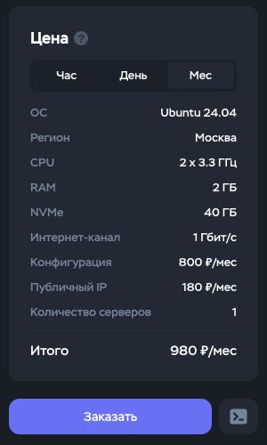
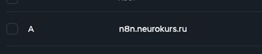
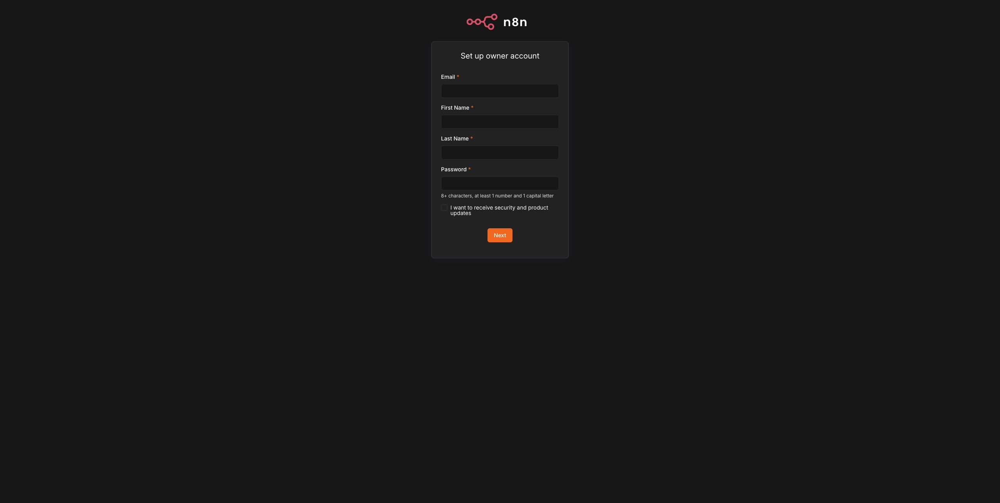

# Как подготовить учебный n8n на `neurokurs.ru`

Проверено: 2026-07-15. Это инструкция для преподавателя без предположения, что он разбирается в серверах. В результате у вас будет отдельный n8n для показа на занятиях по адресу `n8n.neurokurs.ru`.

Участнику курса собственный домен не нужен: для него остаётся отдельный [быстрый старт без домена](quick-start.md).

## Что понадобится

- аккаунт Timeweb Cloud;
- домен, добавленный в раздел «Домены и SSL»;
- банковская карта или деньги на балансе Timeweb;
- около 20–30 минут. Иногда новый адрес начинает работать не сразу — это нормально.

## 1. Создайте отдельный сервер

Сервер — это арендованный компьютер, на котором будет постоянно работать ваш n8n.

В Timeweb Cloud откройте «Облачные серверы» → «Создать сервер» и выберите:

- Ubuntu 24.04;
- Москву;
- 2 CPU, 2 ГБ RAM и 40 ГБ NVMe;
- публичный IPv4.

Отключите платные бэкапы, если они включились автоматически. Проверьте строку «Итого» и только потом нажмите «Заказать».

15 июля 2026 года эта конфигурация стоила 980 ₽/месяц. Цена может измениться.



## 2. Направьте поддомен на сервер

Эта настройка сообщает интернету, где находится ваш n8n. Откройте «Домены и SSL» → ваш домен → «DNS» и добавьте одну запись:

| Поле | Значение |
|---|---|
| Тип | `A` |
| Поддомен | `n8n` |
| Значение | публичный IPv4 нового сервера |
| TTL | `600` |

Для этого стенда итоговый адрес — `n8n.neurokurs.ru`. Основной адрес `neurokurs.ru` остаётся свободным для сайта курса. Сохраните запись. Если домен куплен недавно, новый адрес может заработать через несколько минут или часов.



## 3. Откройте консоль сервера

Вернитесь на страницу созданного сервера и нажмите «Консоль». Откроется чёрное окно — пугаться его не нужно: в следующем шаге вы вставите туда одну готовую строку.

## 4. Вставьте одну команду

Скопируйте всю строку целиком, вставьте в консоль и нажмите Enter:

```bash
curl -fsSL "https://github.com/marcusaure1ius/alfa-ai-course/releases/latest/download/install.sh" | N8N_HOST=n8n.neurokurs.ru TIMEZONE=Europe/Moscow sh
```

Больше ничего вводить не нужно. Не закрывайте окно, пока не появится сообщение «Установка завершена» и адрес `https://n8n.neurokurs.ru`.

## 5. Создайте владельца n8n

Откройте [https://n8n.neurokurs.ru](https://n8n.neurokurs.ru). Вы увидите форму как на снимке ниже. Укажите своё имя, email и придумайте новый уникальный пароль.



Сохраните пароль в менеджере паролей. Не отправляйте его участникам, преподавателю-помощнику или ИИ-агенту. Галочку с рассылкой можно оставить выключенной.

Нажмите `Next`. После короткой настройки откроется рабочий экран n8n — стенд готов.

Перед занятием можно проверить стенд одной командой в той же консоли:

```bash
cd /opt/n8n-entrepreneur-starter-kit && ./scripts/doctor.sh
```

В конце должна быть строка `FAIL=0`. Предупреждение о памяти на выбранном тарифе допустимо для учебного стенда.

## Ожидаемый результат

- `https://n8n.neurokurs.ru` открывается без предупреждения о безопасности;
- после создания владельца открывается рабочий экран n8n;
- после перезагрузки сервера n8n снова открывается;
- повторный запуск команды установки не удаляет настройки и данные.

## Если не получилось

| Что видно | Что сделать |
|---|---|
| Адрес не найден | если домен куплен только что, подождать публикации делегирования и проверить запись `n8n` в Timeweb |
| `429 Too Many Requests` | применить [проверенное решение для Timeweb](reports/2026-07-15-instructor-neurokurs-deployment.md#docker-hub-429), затем повторить ту же команду установки |
| Страница открывается без HTTPS | проверить, что DNS уже указывает на новый сервер, затем подождать автоматическую выдачу сертификата |
| `doctor.sh` показывает `FAIL` | найти строку с `FAIL` и открыть [диагностику](diagnostics.md); не публиковать `.env` и полный лог |
