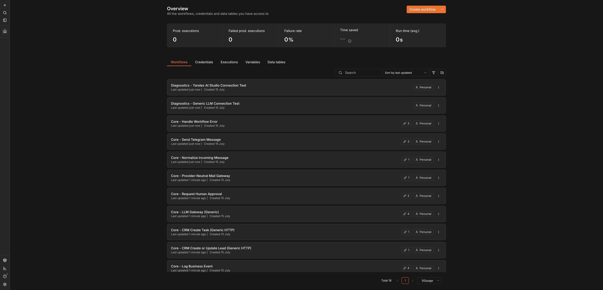

# Шаблоны для занятия уже загружены

Проверено: 2026-07-15. В преподавательском n8n по адресу [n8n.neurokurs.ru](https://n8n.neurokurs.ru) уже находятся 18 готовых workflow. Они выключены и ничего не отправляют во внешние сервисы.

## С каких шаблонов начать

В строке поиска введите `Business`. Для занятия нужны четыре workflow:

| Название в n8n | Что показать участникам | Что понадобится для реального запуска |
|---|---|---|
| `Business - Telegram Assistant` | Получает сообщение, готовит черновик ответа и ждёт подтверждения человека | тестовый Telegram-бот и выбранная модель ИИ |
| `Business - Email Assistant (Draft Only)` | Разбирает письмо и готовит ответ, но не отправляет его автоматически | отдельная учебная почта и модель ИИ |
| `Business - Guarded Lead Handler` | Разбирает новую заявку и показывает, что будет записано в CRM | учебная CRM, Telegram и модель ИИ |
| `Business - Daily Executive Digest` | Собирает события дня и готовит короткую сводку руководителю | источник учебных событий, Telegram и модель ИИ |

Остальные workflow с пометками `Core`, `Adapter` и `Diagnostics` — вспомогательные части. Они уже связаны с основными шаблонами; создавать их заново не нужно.

## Как провести первый показ

1. Откройте `Business - Telegram Assistant`.
2. Покажите схему слева направо и поясните: сообщение принимается, ИИ готовит черновик, человек подтверждает действие.
3. Откройте заметки внутри workflow — в них перечислены необходимые настройки.
4. Вернитесь к списку и покажите остальные три бизнес-сценария.

Для обзорного занятия этого достаточно. Подключать реальные сервисы прямо во время первого знакомства не обязательно.

## Перед реальной демонстрацией

- используйте только отдельные учебные аккаунты и тестовые данные;
- добавляйте ключи и пароли через раздел `Credentials` внутри n8n, а не внутрь блоков workflow;
- сначала проверяйте соединение через workflow с названием `Diagnostics`;
- выполняйте один ручной тест и проверяйте результат;
- включайте workflow только после успешного теста.

## Что пока не делать

Не нажимайте `Publish` или `Activate`, пока не выбраны ваши credentials и не выполнен безопасный тест. Особенно это важно для Telegram, почты и CRM: включённый workflow может начать получать события или выполнять внешние действия.

Сейчас шаблоны находятся в безопасном исходном состоянии:

- всего workflow: 18;
- включённых workflow: 0;
- сохранённых в шаблонах credentials: 0;
- реальных писем, сообщений и CRM-записей при установке не создавалось.

Подробное техническое описание связей и проверок находится в [каталоге workflow](workflow-catalog-and-test-report.md).
