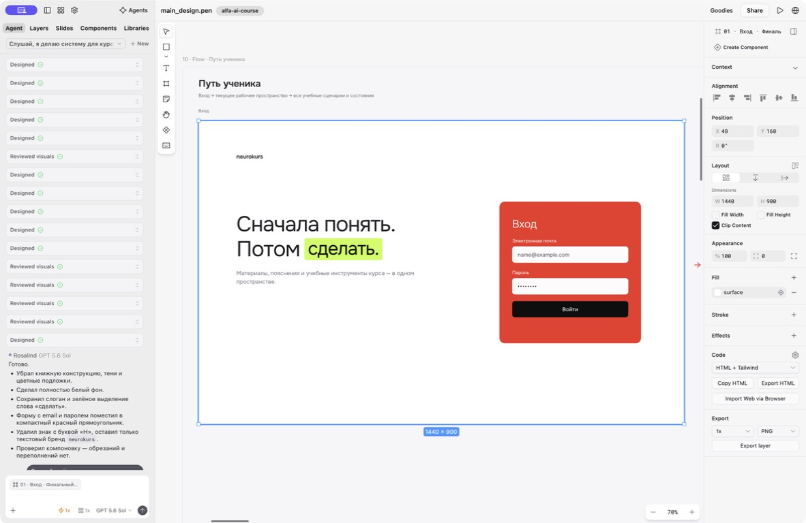
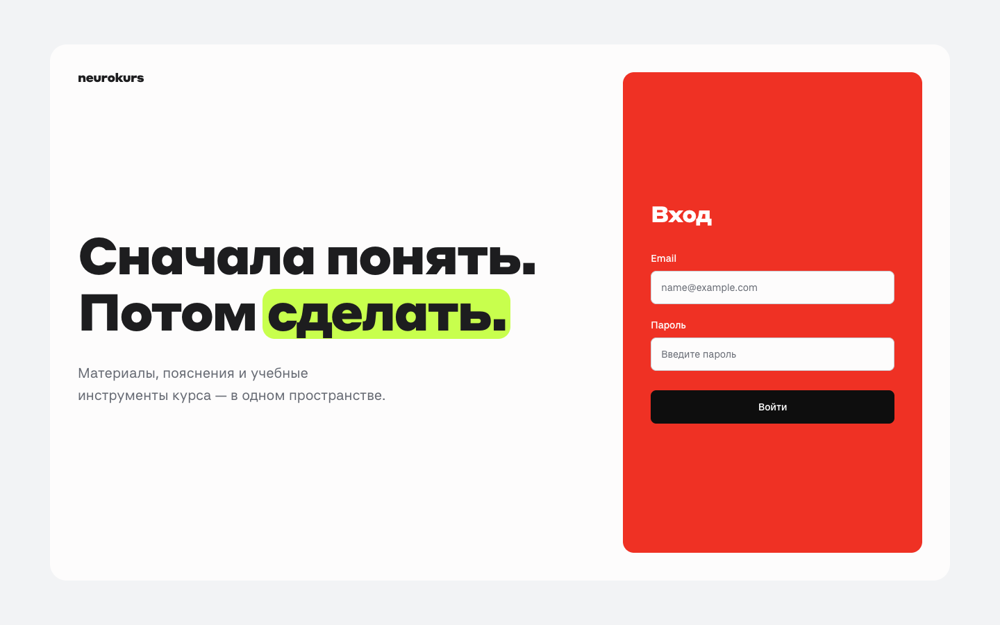
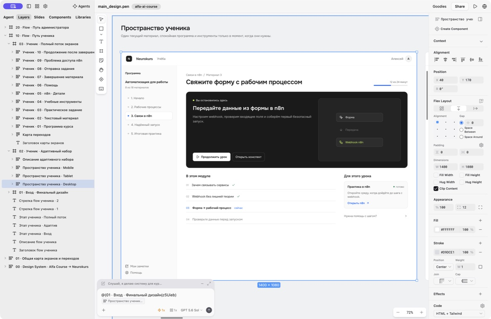
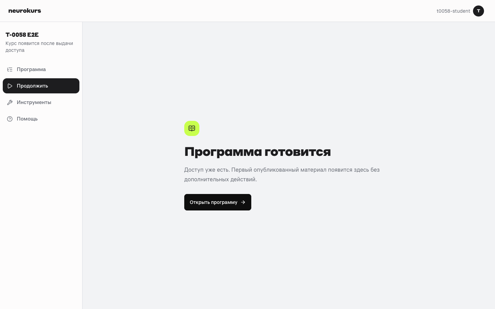
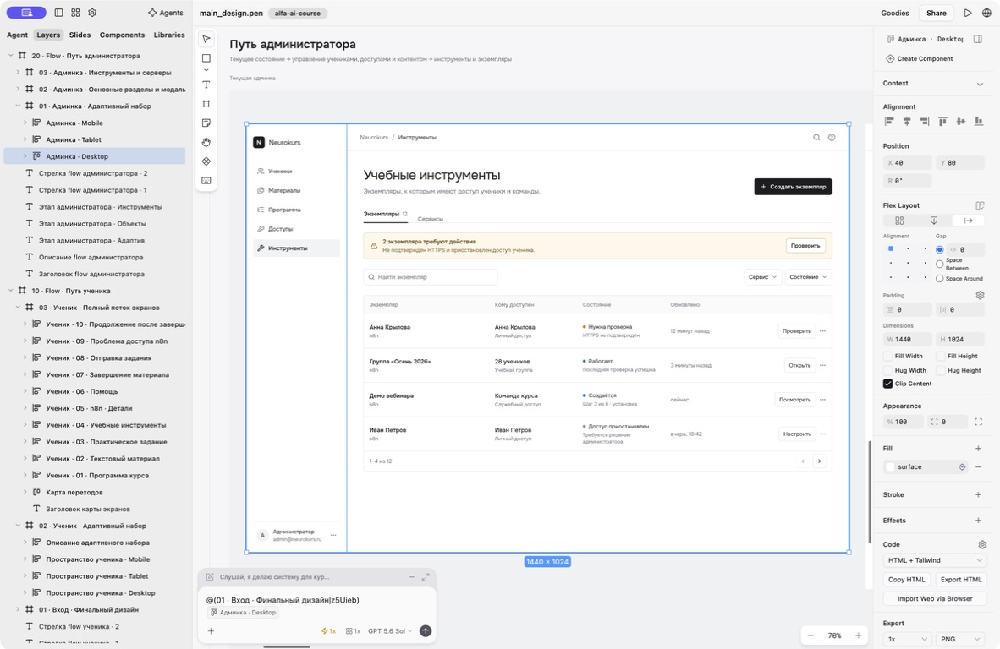
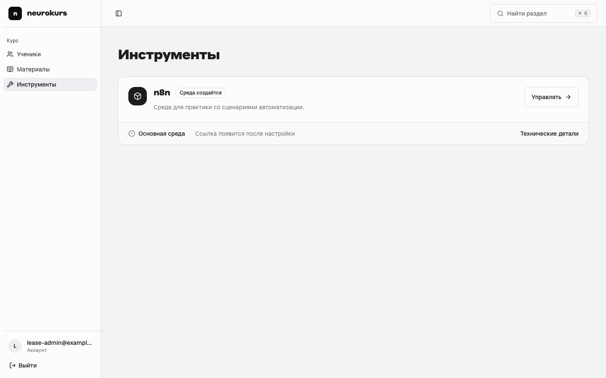
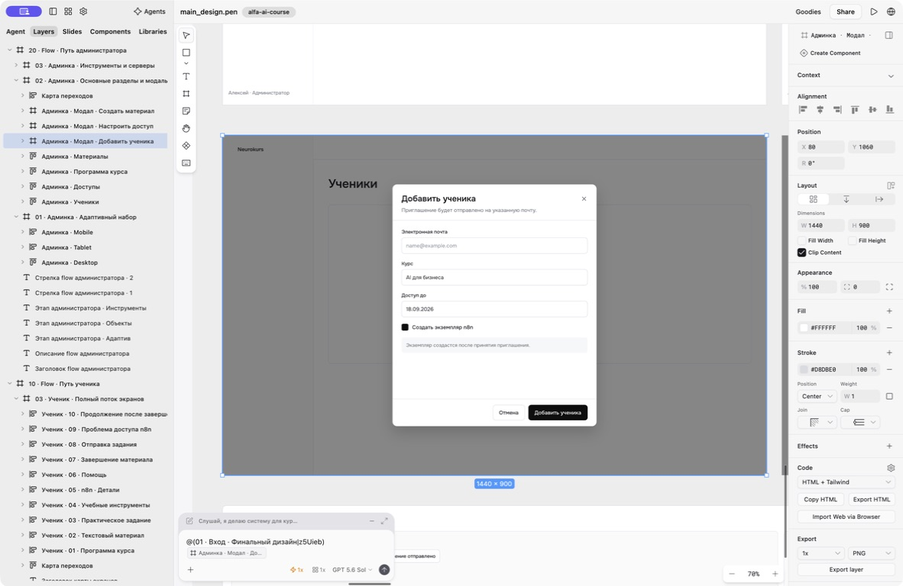
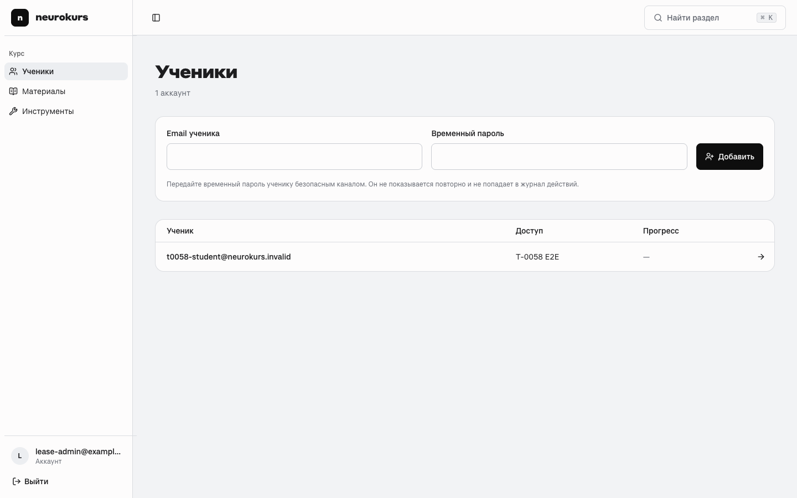

# T-0088 — сверка `main_design.pen` и текущего UI Neurokurs

Дата проверки: 31.07.2026, Europe/Moscow.  
Git baseline: `960ccebf20c1bc4bdd9d9d58a3ec88bbd9581172`.  
Рабочий server: `http://127.0.0.1:3000`, Next.js 16.2.12.  
Источник дизайна: `main_design.pen`, формат 2.14, fingerprint Projects Control `a11e8548438e25ef8a60ab0f1304625e37087a6c40a526852d5145223fb848cd`.

## Итог

Входная уже близка к эталону по композиции, бренду и адаптиву. Внутренний UI пока реализует направление, но не полноту `.pen`: student shell и admin shell существуют, однако большая часть предусмотренных состояний, рабочих таблиц, фильтров, модальных сценариев и связанного feedback отсутствует или заменена более простой inline-формой.

Ключевой вывод: следующий этап — не новый визуальный концепт, а системная reconciliation-реализация. Нужны общие primitives и последовательное прохождение двух flow из `.pen`, а не точечная полировка отдельных страниц.

## Что находится в `.pen`

Файл содержит четыре верхнеуровневых блока:

1. `00 · Design System · Alfa Course → Neurokurs`;
2. `01 · Общая карта экранов и переходов`;
3. `10 · Flow · Путь ученика`;
4. `20 · Flow · Путь администратора`.

В student flow зафиксированы:

- финальный вход;
- desktop/tablet/mobile рабочее пространство;
- программа;
- текстовый материал;
- практическое задание;
- учебные инструменты;
- детали n8n;
- помощь;
- подтверждение завершения материала;
- подтверждение отправки задания;
- проблема доступа к n8n;
- продолжение после завершения.

В admin flow зафиксированы:

- desktop/tablet/mobile рабочая область;
- ученики, доступы, программа и материалы;
- модалки добавления ученика, настройки доступа и создания материала;
- учебные инструменты и экземпляры;
- детали, создание и error state экземпляра n8n;
- подтверждение остановки и удаления.

Текстовая проекция tokens и правил сохранена в [`design-system/neurokurs/MASTER.md`](../../design-system/neurokurs/MASTER.md).

## Визуальная сверка

### Вход

| `.pen` | Текущая реализация |
| --- | --- |
|  |  |

Совпадает: белая композиция, текстовый бренд без знака, двухстрочный слоган, lime-highlight, единственная красная группа входа, чёрная primary-кнопка, корректный mobile stack.

Разница: реальные метрики Styrene делают heading заметно тяжелее и крупнее preview Onest; текущая внешняя серая подложка и большой общий радиус сильнее выражены, чем в финальном фрейме. Это допустимая адаптация, но размеры нужно нормализовать относительно viewport, чтобы вход не доминировал над продуктом.

Mobile evidence: [`current-login-mobile.png`](../assets/design-audit/t0088/current-login-mobile.png).

### Ученик

| `.pen` desktop | Текущий доступный desktop state |
| --- | --- |
|  |  |

Shell и верхнеуровневая навигация реализованы правильно: sticky header, sidebar на desktop, menu/sheet на mobile, отдельные program/tools/help routes. Текущий локальный fixture не содержит материалов, поэтому браузером фактически подтверждён только empty state; остальные выводы сделаны по коду и явно помечены ниже.

Основные расхождения:

- `.pen` строит старт ученика вокруг текущего урока, тёмного task-блока, карты модуля и контекстного инструмента; текущая страница использует другую hero-карточку с декоративными кругами и общий каталог материалов;
- `Завершить материал` сейчас сразу меняет состояние без предусмотренной confirmation modal;
- post-completion экран из `.pen` отсутствует как самостоятельное состояние;
- отправка практического задания и confirmation modal не реализованы;
- problem-report для недоступного n8n не реализован; есть только текстовый attention state;
- строки Help выглядят как интерактивные темы, но являются статическими `div` без следующего действия;
- student surfaces используют много `rounded-2xl` и самостоятельных карточек, тогда как `.pen` чаще группирует страницу крупными плоскими зонами.

Mobile reference: [`pen-student-mobile.png`](../assets/design-audit/t0088/pen-student-mobile.png), текущий empty state: [`current-student-empty-mobile.png`](../assets/design-audit/t0088/current-student-empty-mobile.png).

### Администратор

| `.pen` desktop | Текущие инструменты |
| --- | --- |
|  |  |

В `.pen` админка — плотная рабочая область: пять основных разделов, breadcrumbs, alert strip, фильтры, таблица экземпляров, явные состояния и компактные действия. Текущая админка — качественный, но значительно более пустой shell с тремя разделами и одной крупной карточкой.

Главные расхождения:

- отсутствуют отдельные top-level `Программа` и `Доступы`;
- нет общей data-table системы с filter/search/status/action patterns;
- страницы не показывают информационную плотность и иерархию из `.pen`;
- mobile header отдаёт значительную ширину глобальному поиску и слабо обозначает навигацию;
- список инструментов и технические детали существуют, но flow экземпляров ещё не повторяет структуру списка → details → create → recovery;
- error/loading есть у `/admin/tools`, но не образуют единую библиотеку states для всех разделов.

Mobile evidence: [`current-admin-tools-mobile.png`](../assets/design-audit/t0088/current-admin-tools-mobile.png).

### Формы и модалки

| `.pen`: добавить ученика | Текущая страница учеников |
| --- | --- |
|  |  |

В эталоне добавление ученика — отдельная modal-задача с email, курсом, сроком и опциональным созданием n8n. Сейчас форма постоянно занимает верх страницы и спрашивает только email и временный пароль.

Положительно подтверждено:

- Radix `Dialog`, `AlertDialog`, `Sheet` и `DropdownMenu` дают корректную keyboard/focus основу;
- destructive infrastructure actions имеют отдельное подтверждение, exact-name, re-auth, pending и error feedback;
- controls имеют видимые labels, 48 px высоту, focus ring, disabled/loading states;
- scrim использует `bg-black/50`.

Нужно исправить системно:

- form errors сейчас чаще общие для формы; поля не получают `aria-invalid`, `aria-describedby` и фокус на первое ошибочное поле;
- login и destructive forms не имеют show/hide password;
- длинный material editor не предупреждает о закрытии с несохранёнными данными и не сохраняет draft;
- `Sheet` входит 500 ms, что выбивается из рекомендованных 150–300 ms;
- Dialog/AlertDialog используют `shadow-lg`, хотя дизайн-система строит иерархию без теней;
- обычные create/edit формы смешаны между inline-page и modal без ясного правила;
- завершение учебного материала является обратимым toggle, но UX-концепт требует подтверждения и связанного следующего состояния.

## Приоритеты реализации

### P0 — сценарии и доступность

1. Ввести общий form contract: field error, helper, `aria-invalid`, `aria-describedby`, focus-first-error, pending/success и password visibility.
2. Перевести добавление ученика в Dialog с полями и progressive disclosure из `.pen`.
3. Сделать confirmation + success/continuation для завершения материала.
4. Реализовать отправку задания с URL, валидацией и confirmation modal либо явно исключить её отдельным продуктовым решением.
5. Реализовать report-problem для n8n и действия в Help вместо статических строк.
6. Проверить все modals: Escape, scrim, focus return, mobile overflow, unsaved changes.

### P1 — консистентный visual language

1. Создать primitives: `PageHeader`, `StatusBanner`, `FilterBar`, `DataTable/ListCard`, `EmptyState`, `FormDialog`, `ConfirmDialog`.
2. Свести радиусы к 8/16/32 и убрать card-around-everything.
3. Привести typography к ролям Master вместо page-local размеров.
4. Пересобрать student current-step screen по эталону: тёмный task block, progress, module list и contextual tool.
5. Пересобрать admin tools/instances по эталону: плотная таблица, фильтры, статусы, row actions и details path.
6. Вернуть пять разделов admin IA либо документированно объединить их без потери discoverability.

### P2 — responsive, motion и polish

1. Зафиксировать 375/768/1024/1440 snapshots и landscape.
2. Сократить Sheet motion до 220–300 ms, унифицировать enter/exit и reduced-motion.
3. Проверить реальную Styrene-геометрию заголовков, line wrapping и no-horizontal-scroll.
4. Проверить contrast light/dark отдельно; не считать наличие dark tokens доказательством готового dark mode.
5. Добавить browser checks для modal focus, form errors, empty/loading/error и route navigation.

## Предлагаемая последовательность файлов

1. Tokens/primitives: `platform/src/app/globals.css`, `platform/src/components/ui/*`, новые общие layout/form компоненты.
2. Student shell и flow: `platform/src/components/student/*`, `platform/src/app/student/*`.
3. Admin shell и рабочие разделы: `platform/src/components/shell/*`, `platform/src/components/admin/*`, `platform/src/app/admin/*`.
4. Component tests и browser snapshots на desktop/mobile.

Работа должна начинаться после завершения активной `T-0058`, потому что она затрагивает student access и release readiness в тех же файлах.

## Фактически проверено

- `main_design.pen` открыт в Pen и осмотрены final login, student desktop/mobile, admin desktop и add-student modal.
- `.pen` распарсен как JSON: перечислены фреймы, tokens, тексты и размеры.
- Локальный dev server запущен без внешних cloud mutations.
- `/login`, `/student`, `/admin/tools`, `/admin/students` открыты в Chromium на desktop; `/login`, `/student`, `/admin/tools` сняты на 390×844.
- Login/admin/student страницы не показали Next.js error overlay; browser `errors` пуст.
- `/student` проверен только в empty-course fixture. Материалы, practice и completion states визуально не подтверждены браузером.
- Реальные create/update/delete, внешние credentials и cloud operations не вызывались.

## UI/UX Pro Max

Использованы priority rules Accessibility → Interaction → Responsive → Style → Forms/Feedback → Navigation, а также Next.js stack check. Автоматическая style-подборка дала палитру, противоречащую брендовой системе `.pen`, поэтому она не использована. Применены подходящие общие правила: одна primary CTA, visible labels, inline errors, focus management, 44 px hit area, 4.5:1 contrast, no hover-only actions, modal escape route, 150–300 ms motion и reduced-motion.
