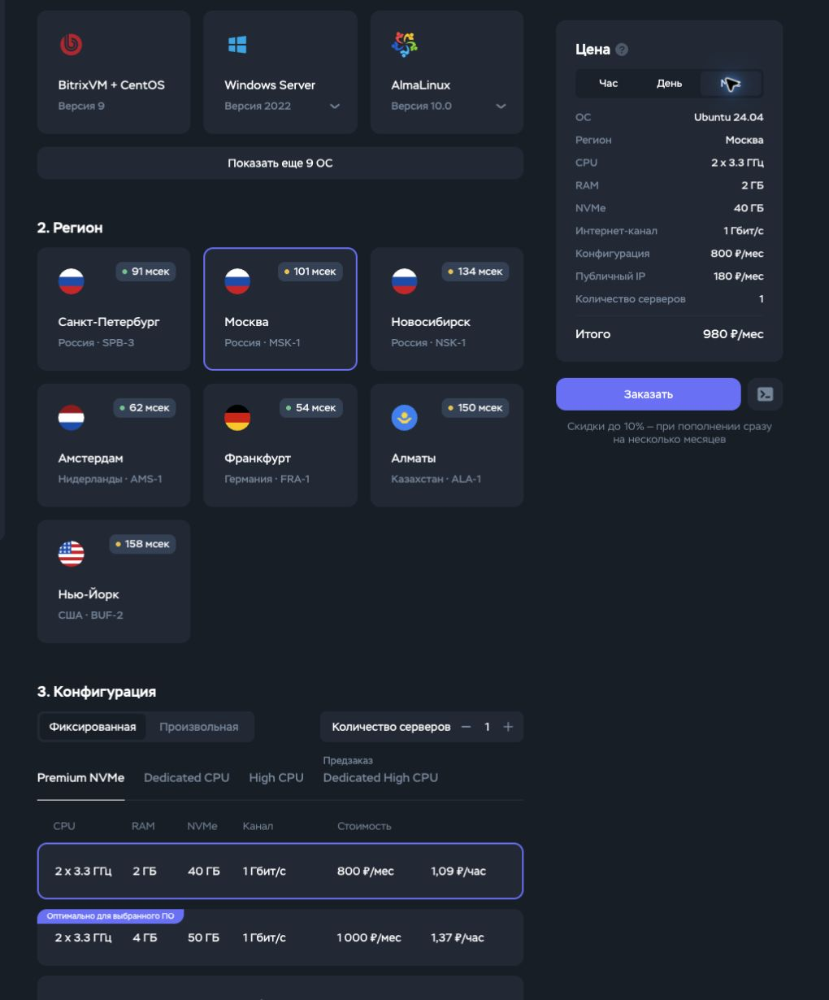
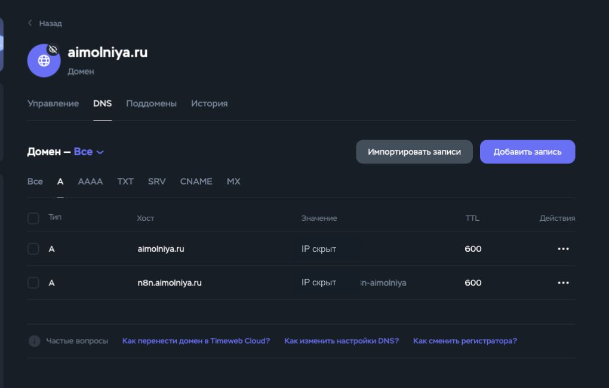
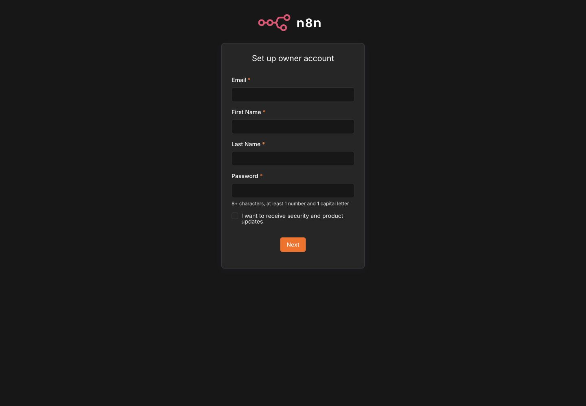

# Чистая установка n8n в Timeweb Cloud — пошагово

Проверено фактически: 2026-07-14. Инструкция рассчитана на человека без опыта DevOps. Она повторяет реальное развёртывание этого репозитория на новом VPS и отделяет подтверждённые результаты от действий, которые владелец должен выполнить сам.

## Что получилось

На момент проверки работает отдельный адрес `https://n8n.aimolniya.ru/`:

- VPS: Ubuntu 24.04 LTS, `x86_64`, Москва;
- конфигурация: 2 vCPU, 2 GB RAM, 40 GB NVMe и публичный IPv4;
- контейнеры `postgres`, `n8n` и `caddy` имеют состояние `running/healthy`;
- редактор и `/healthz` отвечают через HTTPS;
- сертификат Let's Encrypt выпущен для `n8n.aimolniya.ru` и действителен до 2026-10-12;
- PostgreSQL не опубликован в интернет: внешний TCP `5432` закрыт;
- форма создания первого owner открывается, но owner-аккаунт намеренно не создавался — пароль должен придумать и сохранить сам владелец.

Фактический `doctor.sh` завершился без `FAIL` и с одним `WARN`: Timeweb показывает тариф как 2 GB RAM, а Linux видит объём между 1 и 2 GiB из-за различия десятичных GB и двоичных GiB. Для учебного стенда этого достаточно; для постоянной нагрузки лучше перейти на тариф с 4 GB после отдельного подтверждения новой стоимости.

## Сколько это стоит

Перед заказом 2026-07-14 панель Timeweb показала:

| Ресурс | Стоимость |
|---|---:|
| Сервер 2 vCPU / 2 GB / 40 GB | 800 ₽/месяц |
| Публичный IPv4 | 180 ₽/месяц |
| Итого | 1,34 ₽/час, 32,13 ₽/день или 980 ₽/месяц |

Цена может измениться. Всегда перепроверяйте блок «Итого» перед кнопкой «Заказать». Бэкапы в этот расчёт не входят.

## 1. Подготовьте SSH-ключ

SSH-ключ заменяет вход по паролю. Создавайте отдельный ключ для сервера, а не используйте основной личный ключ:

```bash
ssh-keygen -t ed25519 -a 64 -f "$HOME/.ssh/n8n_timeweb"
```

Будут созданы два файла:

- `~/.ssh/n8n_timeweb` — приватный ключ; его нельзя отправлять или загружать в панель;
- `~/.ssh/n8n_timeweb.pub` — публичная часть; только её добавляют в Timeweb.

В проверенном проходе использован уже существовавший отдельный ключ `aimolniya_deploy`. Приватная часть в браузер не передавалась.

## 2. Создайте сервер

Откройте «Облачные серверы» → «Создать сервер» и выберите:

| Поле | Значение |
|---|---|
| Образ | Ubuntu 24.04 |
| Регион | Москва, MSK-1 |
| Тариф | Premium NVMe, 2 x 3.3 GHz, 2 GB, 40 GB |
| Сеть | публичный IPv4 включён |
| Бэкапы и платные защиты | выключены для учебного стенда |
| Имя хоста и сервера | понятное имя, например `n8n-company` |
| Авторизация | загрузить только файл `.pub` |



Перед «Заказать» ещё раз проверьте ОС, регион, RAM, диск, публичный IP, дополнительные услуги и итоговую цену. Нажатие запускает почасовое списание.

Когда панель покажет «В сети», подключитесь с компьютера:

```bash
export VPS_IP="203.0.113.10" # замените на IPv4 из панели Timeweb
ssh -i "$HOME/.ssh/n8n_timeweb" "root@$VPS_IP"
```

На VPS обязательно проверьте ОС и архитектуру:

```bash
. /etc/os-release
printf 'OS=%s VERSION=%s ARCH=%s\n' "$ID" "$VERSION_ID" "$(uname -m)"
```

Ожидаемый результат:

```text
OS=ubuntu VERSION=24.04 ARCH=x86_64
```

Если значение отличается — остановитесь и пересоздайте сервер с правильным образом. Не пытайтесь превращать другую ОС в Ubuntu обновлением пакетов.

## 3. Добавьте отдельный DNS-адрес

В «Домены и SSL» → ваш домен → «DNS» нажмите «Добавить запись»:

| Поле | Значение |
|---|---|
| Тип | `A` |
| Поддомен | `n8n` |
| Сервис/IP | созданный VPS |
| TTL | `600` |

Корневую запись домена, почтовые MX/TXT и другие существующие записи не меняйте.



Проверьте распространение DNS на своём компьютере:

```bash
dig +short A n8n.example.com
```

Вместо `n8n.example.com` укажите свой адрес. Команда должна вывести публичный IPv4 VPS. Пустой результат означает, что нужно подождать; не запускайте диагностику HTTPS как успешную до появления адреса.

## 4. Передайте только закоммиченный комплект

Команды ниже выполняются на вашем компьютере в корне репозитория. Подставьте адрес и путь к своему ключу:

```bash
export VPS_IP="203.0.113.10" # замените на IPv4 из панели Timeweb
export SSH_KEY="$HOME/.ssh/n8n_timeweb"

git archive --format=tar.gz --prefix=n8n-starter-kit/ \
  --output=/tmp/n8n-starter-kit.tar.gz HEAD
shasum -a 256 /tmp/n8n-starter-kit.tar.gz \
  | awk '{print $1 "  n8n-starter-kit.tar.gz"}' \
  > /tmp/n8n-starter-kit.tar.gz.sha256

scp -i "$SSH_KEY" \
  /tmp/n8n-starter-kit.tar.gz \
  /tmp/n8n-starter-kit.tar.gz.sha256 \
  "root@$VPS_IP:~/"
```

На VPS:

```bash
sha256sum -c n8n-starter-kit.tar.gz.sha256
tar -xzf n8n-starter-kit.tar.gz
cd n8n-starter-kit
```

Ожидается строка `n8n-starter-kit.tar.gz: OK`. При `FAILED` удалите полученный архив, передайте его снова и не продолжайте установку.

Фактически проверенная установка использовала archive из commit `9345f2d565a2f6011bb5f40727c2724b8e3799ff`.

## 5. Сначала выполните безопасную проверку

На VPS:

```bash
export N8N_HOST="n8n.example.com"
export ACME_EMAIL="you@example.com"
export TIMEZONE="Europe/Moscow"

N8N_HOST="$N8N_HOST" \
ACME_EMAIL="$ACME_EMAIL" \
TIMEZONE="$TIMEZONE" \
./scripts/install.sh --non-interactive --dry-run
```

Подставьте свой домен и email. Dry-run должен завершиться строкой `Dry-run завершён` и ничего не устанавливает. Остановитесь при `FAIL`, несовпадении ОС/архитектуры, занятом порте 80/443 или неправильном DNS.

## 6. Установите n8n

Если dry-run прошёл:

```bash
N8N_HOST="$N8N_HOST" \
ACME_EMAIL="$ACME_EMAIL" \
TIMEZONE="$TIMEZONE" \
./scripts/install.sh --non-interactive
```

Установщик:

1. ставит закреплённые Docker Engine и Compose;
2. создаёт `.env` с правами `0600`;
3. генерирует постоянный `N8N_ENCRYPTION_KEY` и пароль PostgreSQL без вывода значений;
4. скачивает закреплённые образы;
5. запускает PostgreSQL, n8n и Caddy.

Не показывайте содержимое `.env` и не копируйте его в Git.

### Если Docker Hub ответил `429 Too Many Requests`

На фактическом Timeweb VPS первый pull встретил этот временный лимит. Публичный cache `mirror.gcr.io`, управляемый Google Cloud, можно подключить к Docker daemon по [официальной инструкции Google](https://docs.cloud.google.com/artifact-registry/docs/pull-cached-dockerhub-images):

```bash
printf '%s\n' '{"registry-mirrors":["https://mirror.gcr.io"]}' \
  | sudo tee /etc/docker/daemon.json >/dev/null
sudo systemctl restart docker
docker info | sed -n '/Registry Mirrors/,+2p'
```

После этого повторите установщик: повторный запуск сохраняет уже созданные secrets. Если лимит остаётся только для `docker.n8n.io`, выполните проверенный fallback с точной версией и обязательной сверкой digest:

```bash
docker pull mirror.gcr.io/n8nio/n8n:2.29.10
docker image inspect mirror.gcr.io/n8nio/n8n:2.29.10 \
  --format '{{.Id}}'
```

Ожидаемый digest проверенного образа:

```text
sha256:9cb60554716a0ab11a966e79ed65171e1bbf00b6d262ba12aa119bba22eb6000
```

Если digest отличается — остановитесь. Если совпадает:

```bash
docker tag mirror.gcr.io/n8nio/n8n:2.29.10 \
  docker.n8n.io/n8nio/n8n:2.29.10
docker compose up -d --wait
```

Этот fallback не меняет Compose или версию n8n; он подготавливает локальный образ с проверенным digest и запускает stack из закоммиченного архива.

## 7. Проверьте результат

На VPS:

```bash
docker compose ps
./scripts/doctor.sh
```

Ожидается:

- `postgres`, `n8n` и `caddy` — `running/healthy`;
- `external.dns`, `external.https` и `external.certificate` — `OK`;
- `FAIL=0`;
- предупреждение про RAM допустимо только для минимального учебного тарифа.

С компьютера:

```bash
curl --fail --show-error https://n8n.example.com/healthz
curl --silent --output /dev/null --write-out '%{http_code}\n' \
  https://n8n.example.com/
```

Ожидается `{"status":"ok"}` и HTTP `200`.

Откройте адрес в браузере. Появится форма первого owner:



Создайте owner самостоятельно. Используйте уникальный пароль из менеджера паролей и не присылайте его преподавателю, агенту или в чат.

## Как остановить расходы

Простая остановка VPS может не прекратить оплату диска и публичного IPv4. Если стенд больше не нужен:

1. при необходимости сделайте backup по [инструкции](backup-and-restore.md);
2. убедитесь, что важные workflow экспортированы;
3. удалите сервер в Timeweb;
4. отдельно проверьте раздел публичных IP и удалите неиспользуемый платный адрес;
5. убедитесь в разделе платежей, что платные ресурсы исчезли.

Удаление уничтожает данные VPS. В рамках этого прохода сервер не удалялся и оставлен владельцу для дальнейшей работы.

## Что не делалось

- не создавался owner-аккаунт и не задавался его пароль;
- не подключались Telegram, CRM, почта или LLM credentials;
- не включались платные backups, DDoS-защита или дополнительные услуги;
- не заявлялся успешный production load-test;
- сервер не удалялся автоматически.
